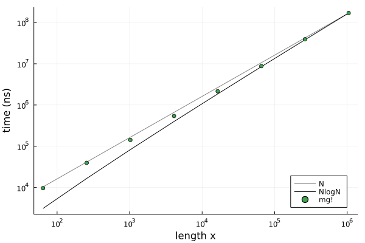

# Geometric Multigrid

Working on high speed solutions for variable coefficient Poisson equations on Cartesian grids.

|  | 
|:--:| 
| Median time [benchmark example](benchmark/benchmark.jl) for `mg!` solver demonstrating `NlogN` scaling with the length of the solution vector.|
